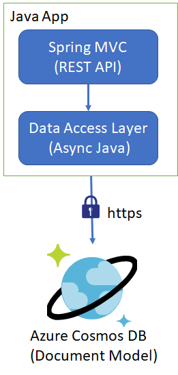

# Async SDK flavour for executing custom queries
This sample is created to demonstrate single/multiple query executions for the users using @query annotation in Spring Data SDK of Couchbase. If your use cases uses mostly customer queries then it is good to have direct SDK to avoid some overheads of Spring Data based SDK. 


Following is the high level architecture of the sample application:



So, we have MVC controller which is exposed as a REST API and behind the scenes we have CosmosDBHelper class to be treated as Data Access Layer (DAL) which performs CRUD operations.
Let us take deep look:
##### Client Initialization
```
ConnectionPolicy cp=new ConnectionPolicy();
cp.connectionMode(ConnectionMode.DIRECT);

if(client==null)
	client= CosmosClient.builder()
			.endpoint(Host)//(Host, MasterKey, dbName, collName).Builder()
		    .connectionPolicy(cp)
		    .key(MasterKey)
		    .consistencyLevel(ConsistencyLevel.EVENTUAL)
		    .build();		
```
Please note the connecion mode I have selected is direct assuming there is a trust network between client and the server. Then I have specified host name & key, and consistency as eventual. As these are user specific parameter hence feel free to change it according to your requirement. Then we have two methods which are:
- ExecuteQuery: This method will mimick the @query annotation functionality and takes query as a SQLQuerySpec object which includes query as string & list of parameters. Following is the code snippet:
#### Execute Query
```
FeedOptions fo=new FeedOptions();
if(partitionKeyValue!="")
{		
	fo.partitionKey(new PartitionKey(partitionKeyValue));
	fo.enableCrossPartitionQuery(false);
}
else
{
	fo.enableCrossPartitionQuery(true);
}
CountDownLatch latch=new CountDownLatch(1);
_docs=new ArrayList<CosmosItemProperties>();
Flux<FeedResponse<CosmosItemProperties>> objFlux= container.queryItems(query, fo);
	objFlux.publishOn(Schedulers.elastic())
	
	.subscribe(feedResponse ->{
		if(feedResponse.results().size()>0)
		{
			_docs.addAll(feedResponse.results());
		}
	},Throwable::printStackTrace,latch::countDown);
		
latch.await();
		
return  _docs;
```
- ExecuteQueries: This method will exactly same as ExecuteQuery method but will take multiple queries and run the queries in parallel. Following is the code snippet:
#### Execute Queries
``` 			
FeedOptions fo=new FeedOptions();
if(partitionKeyValue!="")
{		
	fo.partitionKey(new PartitionKey(partitionKeyValue));
	fo.enableCrossPartitionQuery(false);
}
else
{
	fo.enableCrossPartitionQuery(true);
}
			
ArrayList<Flux<FeedResponse<CosmosItemProperties>>> lstFlux = new ArrayList<>();
CountDownLatch latch=new CountDownLatch(queries.size());
Flux<FeedResponse<CosmosItemProperties>> objFlux = null;
			
for(SqlQuerySpec query:queries)
{
		objFlux= container.queryItems(query, fo);
				
	objFlux .publishOn(Schedulers.elastic())
			.subscribe(feedResponse->
				{
					if(feedResponse.results().size()>0)
					{
						_docs.addAll(feedResponse.results());
					}
							
				},
				Throwable::printStackTrace,latch::countDown);
lstFlux.add(objFlux);
}
						
Flux.merge(lstFlux);
latch.await();

```
Further more to demonstrate the usage of the abovementioned methods, a sample is created, as:
#### getDataByStatus
```
String query="select * from c where c.status=@status";
objSQL.queryText(query);
SqlParameterList objParams=new SqlParameterList();
objParams.add(new SqlParameter("@status", Status));
objSQL.parameters(objParams);
List<Review> lstReview=new ArrayList<Review>();
List<CosmosItemProperties> gg= executeQuery(objSQL, "");
for(CosmosItemProperties obj:gg)
{
	lstReview.add(obj.toObject(Review.class));
}
```
#### Running this Sample
Also, this sample will include Create, Upsert & Delete operation samples as well. In order to run this sample, you need to use REST client e.g. Postman and send your requests to: 
```<language>
http://<hostname>/documents/<operationname>
```
Following are the set of REST API provided as part of the sample:
1. createDocument
2. upsertDocument
3. getDocuments
4. deleteDocument

Before running the sample please change the configuration specified in the application.properties as:
#### Application.Properties
> #Specify the DNS URI of your Azure Cosmos DB.
> azure.cosmosdb.uri=https://<accountname>.documents.azure.com:443/
> 
> #Specify the access key for your database.
> azure.cosmosdb.key=<PrimaryKey>
> 
> #Specify the name of your database.
> azure.cosmosdb.database=<nameOfDatabase>
> 
> #Specify the name of your collection.
> azure.cosmosdb.collection=<nameOfCollection>


**Please note:** The collection shouldn't exists before otherwise it will generate an error. Also, once this sample executes and irrespective of error/success it will delete this collection while existing the sample program.