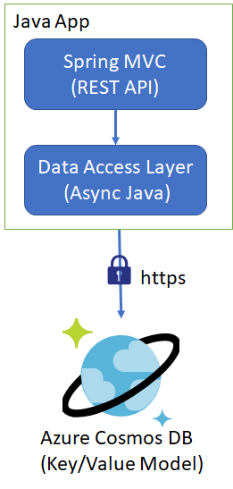

# Azure Cosmos DB to be treated as Key/Value pair

Azure Cosmos DB is the most customizable Database available in the industry, apart from being Document, Graph, columnar models, it can be configured to use Key/Value pair model as well.

Here is the tentative architecture:


To configure it to be as Key/Value pair data model you can modify indexing policy as:

```
{
    "indexingMode": "none"
}
```

Then perform the document lookup as:
```
CosmosItemRequestOptions ro=new CosmosItemRequestOptions();
ro.partitionKey(new PartitionKey(documentId));
CountDownLatch latch=new CountDownLatch(1);
		
var objCosmosItem= container.getItem(documentId, documentId);
Mono<CosmosItemResponse> objMono = objCosmosItem.read(ro);
```

To insert:
```
Mono<CosmosItemResponse> objMono= container.createItem(doc,ro);
```
To upsert:
```
Mono<CosmosItemResponse> obs= container.upsertItem(doc, ro);
```
To delete:
```
CosmosItem objItem= container.getItem(id, id);
Mono<CosmosItemResponse> objMono = objItem.delete(ro);
```