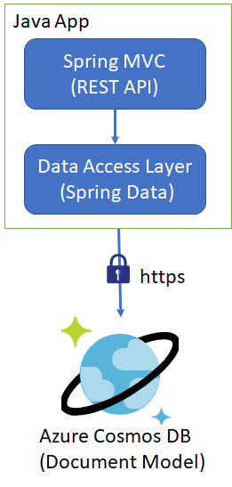

# Using Azure Cosmos DB's Spring data SDK
In case your workload consists of Spring Data CouchBase SDK and you are not using custom queries in most of the methods then continue reading this guidance otherwise switch to Async SDK, refer [here](https://github.com/manishmsfte/CouchbaseToCosmosDB/tree/master/AsyncInSpring).

Here is the architecture looks like:




As Azure Cosmos DB is the distributed database hence, it would need partition key to create partitions for storing the data hence it is suggested to do the following:

Open your POJO class and specify the following:
- @Collection annotation ontop of the class, you can further specify the properties of the collection within the same annotation.
- @PartitionKey annotation to denote a field to be treated as partition key.
- @Id annotation to denote a field to be treated as Id (it's value should be unique within a partition).

Here is the code snippet for your reference:
```
@Document(collection = "mycollection1", ru = "4000", timeToLive = 500)
public class CustomDoc {
	@Id
	private String id;

	/**
	 * @return the id
	 */
	public String getId() {
		return id;
	}

	/**
	 * @param id the id to set
	 */
	public void setId(String id) {
		this.id = id;
	}

	@PartitionKey
	private String name;

	/**
	 * @return the name
	 */
	public String getName() {
		return name;
	}

	/**
	 * @param name the name to set
	 */
	public void setName(String name) {
		this.name = name;
	}

```
CRUD methods are very simple and mostly generic e.g. findById or findByStatusAndName which will use partition key.

.save method will serve update as well as upsert operation and .delete will delete the document